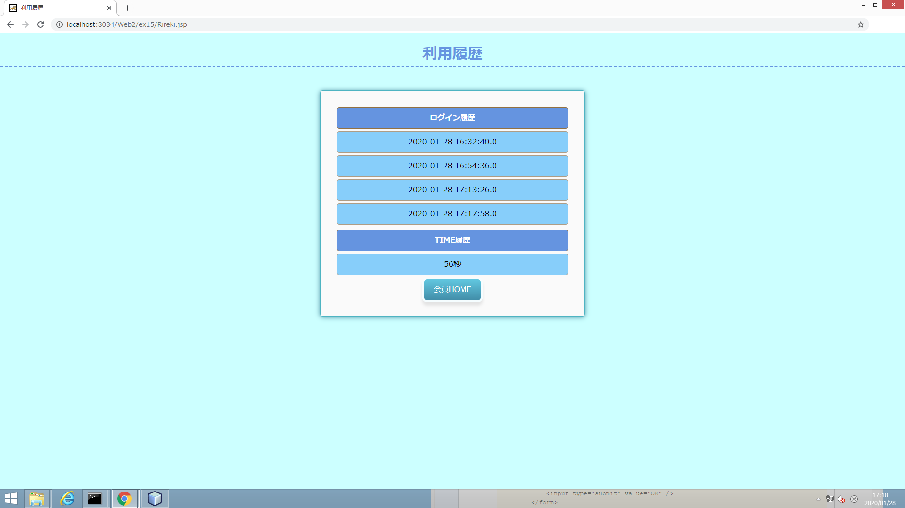

# 神経衰弱Webアプリケーション(-PlayingCardsGame)

タイムアタックモードとパーティーモードの２種類で遊ぶことができるWebアプリケーション。このアプリケーションはユーザ登録を行う必要がある。
タイムアタックモードでは、全10組のカードを揃えるまでの時間を計測し、他のユーザとのタイムを競う。
パーティーモードでは、最大4人まで遊ぶことができる。1人で遊びたい時は、他の3プレーヤーをコンピューターにすることで遊ぶことができる。

## 開発環境

* Java/JSP
* HTML
* CSS
* JavaScript
* MySQL
* NetBeans
 
## 画像

